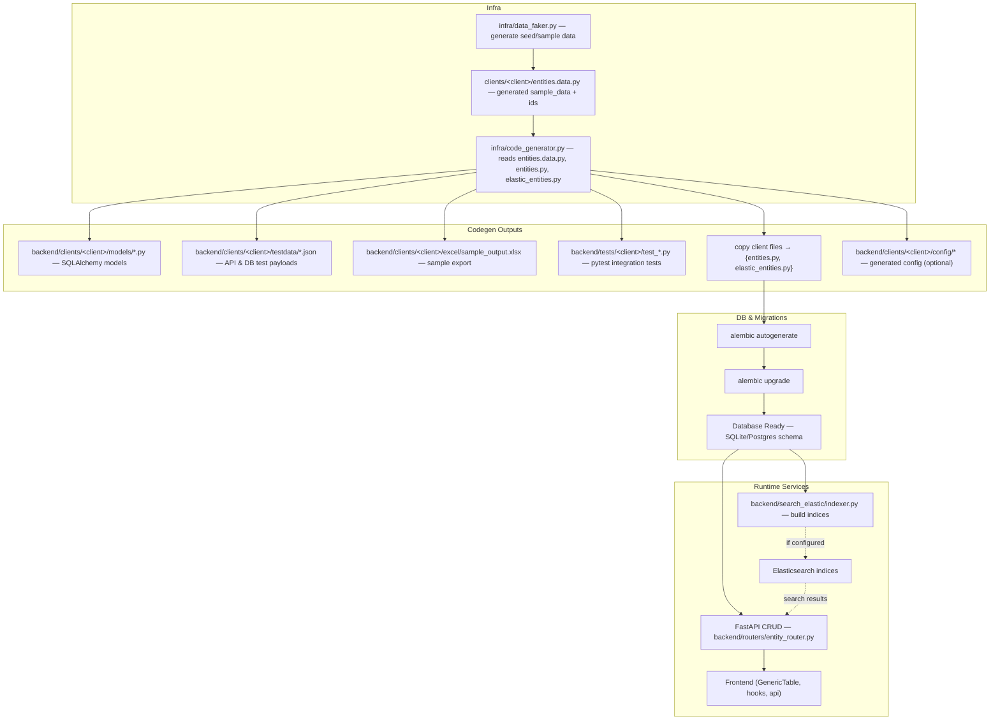
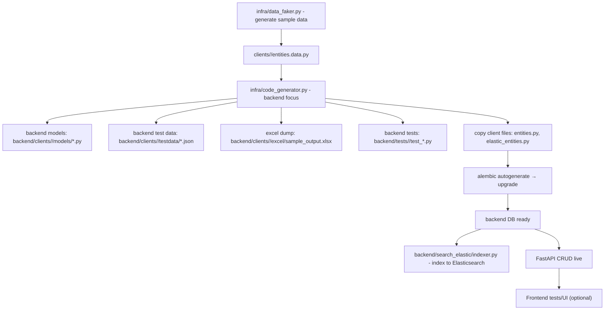
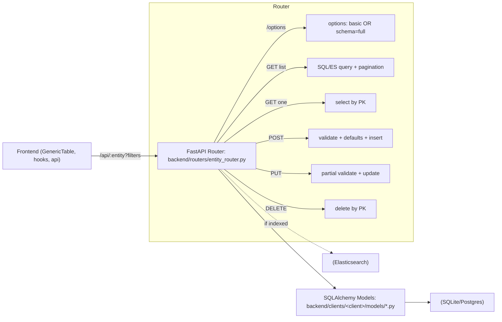

```
flowchart LR
  FE["Frontend (GenericTable, hooks, api)"]
    --> |"/api/{entity}?filters,sort,limit,offset"| R["FastAPI Router: backend/routers/entity_router.py"]

  %% Domain configs feeding router behavior
  ENT["clients/&lt;client&gt;/entities.py — fields, defaults, validators, options schema"] --> R
  ESE["clients/&lt;client&gt;/elastic_entities.py — indexing rules"] --> R

  %% Router internals
  subgraph ROUTER["Router"]
    direction TB
    R --> |"/options"| OPT["Options: basic or schema=full (fields + defaults + validators)"]
    R --> |"GET list"| GETL["Query builder → SQL or ES + pagination"]
    R --> |"GET one"| GET1["Select by primary key"]
    R --> |"POST"| POST["Validate → apply defaults → insert → audit"]
    R --> |"PUT"| PUT["Partial validate → update by PK → audit"]
    R --> |"DELETE"| DEL["Delete by PK"]
  end

  %% Models + DB
  R --> |"model resolution"| MDL["backend/clients/&lt;client&gt;/models/*.py — SQLAlchemy"]
  MDL --> DB["DB (SQLite/Postgres)"]

  %% Optional ES path
  R -. "if indexed" .-> ES["Elasticsearch"]
  ES -. "search results" .-> R

  %% Response back to UI
  R --> RESP["JSON: {items, count} or {item} or {error[]}"]
  RESP --> FE
```





```
$ Nonpx create-next-app@latest nishify.io 
✔ Would you like to use TypeScript? … No / Yes
✔ Would you like to use ESLint? … No / Yes
✔ Would you like to use Tailwind CSS? … No / Yes
✔ Would you like your code inside a `src/` directory? … No / Yes
✔ Would you like to use App Router? (recommended) … No / Yes
✔ Would you like to use Turbopack for `next dev`? … No / Yes
✔ Would you like to customize the import alias (`@/*` by default)? … No / Yes    => @ bole to src and import easy no need of .././ just use @
Creating a new Next.js app in /Users/nishantsaxena/workspace/nishify/nishify.io


nishify.io/
├── public/
├── src/
│   ├── app/              # App Router enabled
│   ├── components/       # Reusable components (Nav, Hero, Footer, etc.)
│   ├── sections/         # Page sections (Hero, About, Projects, etc.)
│   ├── styles/           # Tailwind + any custom styles
│   └── utils/            # Any helper functions or constants
├── tailwind.config.ts
├── tsconfig.json
├── next.config.js
└── package.json

$ git remote -v 
origin	https://github.com/nishantsaxena888/nishify.git (fetch)
origin	https://github.com/nishantsaxena888/nishify.git (push)

# Note : not  https but git i.e. ssh is set , so it won't prompt for password
git remote set-url origin git@github.com:nishantsaxena888/nishify.git
> Idea : TOC main FAQ 
>> move all this to TOC
```

